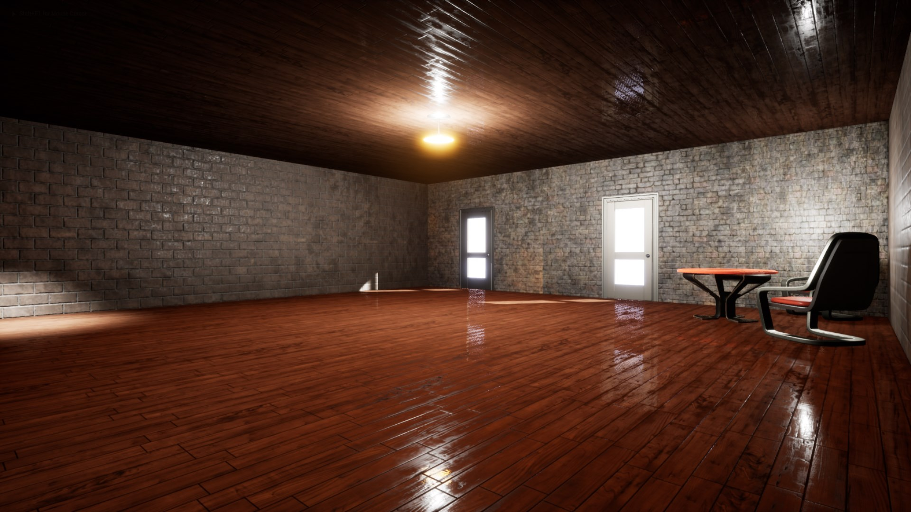
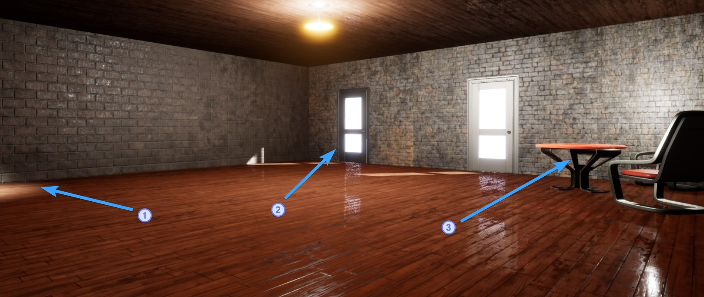

# Building Escape 
### This is a demo game scene built on Unreal Engine 4

## It is an attempt to work with:
	* Meshes and Materials
	* C++ events accessed from Blueprints
	* Calling C++ code from Blueprint
	* Level editor

#### What's included:

1. TriggerVolume, which handles OpenDoor event. If there's enough mass is inside Trigger Volume -> open the doors.
2. Openable doors (StaticMeshComponent), depends on TriggerVolume^^
3. Objects that the player can grab and move throughout the room.
